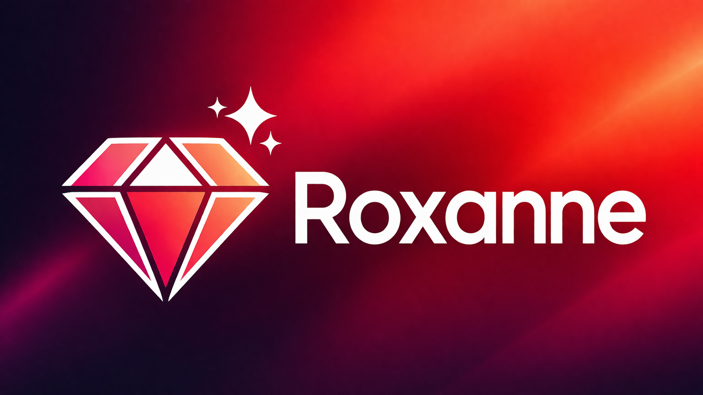

# Roxanne

Roxanne is a local-first research copilot for text and spoken voice conversations with your Zotero library and Obsidian knowledge base using Anthropic, OpenAI, or local Ollama models. It works by indexing and embedding your entire Zotero library database and Obsidian vaults, it then uses agentic MCP to search, read and even update Zotero and Obsidian.

## Install

The install scripts pull the latest published Roxanne release for your platform and install it for you.

### macOS or Linux

```bash
curl -fsSL https://raw.githubusercontent.com/TylerIllman/Roxanne/main/scripts/install.sh | bash
```

### Windows PowerShell

```powershell
irm https://raw.githubusercontent.com/TylerIllman/Roxanne/main/scripts/install-windows.ps1 | iex
```

### Optional install flags

Install a specific version:

```bash
ROXANNE_VERSION=v0.1.2 curl -fsSL https://raw.githubusercontent.com/TylerIllman/Roxanne/main/scripts/install.sh | bash
```

```powershell
$env:ROXANNE_VERSION="v0.1.2"; irm https://raw.githubusercontent.com/TylerIllman/Roxanne/main/scripts/install-windows.ps1 | iex
```

Install without auto-opening the app:

```bash
ROXANNE_NO_OPEN=1 curl -fsSL https://raw.githubusercontent.com/TylerIllman/Roxanne/main/scripts/install.sh | bash
```

```powershell
$env:ROXANNE_NO_OPEN="1"; irm https://raw.githubusercontent.com/TylerIllman/Roxanne/main/scripts/install-windows.ps1 | iex
```

On macOS, the CLI installer removes the quarantine attribute after installation so the app can open more cleanly than a normal browser download.

After install, you can launch Roxanne from a terminal with:

```bash
roxanne
```

On macOS and Linux this launcher is installed into `~/.local/bin`. If `roxanne` is not found, add `~/.local/bin` to your `PATH`.

## Develop Locally

### Prerequisites

- Python 3.10+
- Node.js 20+
- optional: [Ollama](https://ollama.com) for local models

### Clone the repo

```bash
git clone https://github.com/TylerIllman/Roxanne.git
cd Roxanne
```

### One-command setup

The quickest source install is:

```bash
npm run setup
```

That creates `apps/backend/.venv`, installs the editable backend with test dependencies, and installs the desktop dependencies.

If you prefer the manual steps instead:

### Set up the backend

```bash
python3 -m venv apps/backend/.venv
source apps/backend/.venv/bin/activate
pip install -e "./apps/backend[test]"
```

Windows PowerShell:

```powershell
py -3 -m venv apps/backend/.venv
.\apps\backend\.venv\Scripts\Activate.ps1
pip install -e ".\apps\backend[test]"
```

### Install frontend dependencies

```bash
npm install
```

### Run Roxanne in development

Open the full app from the repo:

```bash
npm run open:desktop
```

For easier debugging, these commands keep the backend and desktop shell separate:

```bash
npm run debug:backend
npm run debug:frontend
npm run debug:desktop
npm run debug:full
```

What they do:

- `npm run debug:backend` starts only the FastAPI backend with reload and debug logging.
- `npm run debug:frontend` starts only the renderer dev server.
- `npm run debug:desktop` starts the Electron shell and points it at an already-running backend on `http://127.0.0.1:8000`.
- `npm run debug:full` runs the backend plus the Electron shell workflow together.

Roxanne is not currently published as an `npm` or `pip` package, so the release installer remains the simplest no-build install path for end users. If you want a package-manager install later, that should be done as a separate publish/distribution change rather than just a repo script.

## Build The App Locally

Make sure the backend virtual environment exists and has the build dependencies installed:

```bash
source apps/backend/.venv/bin/activate
pip install -e "./apps/backend[build]"
```

Then build the desktop app from the repo root:

```bash
ROXANNE_PYTHON_BIN="$PWD/apps/backend/.venv/bin/python3" npm run pack:desktop
```

That creates an unpacked packaged build for your current platform.

To build the actual installer for your current platform:

```bash
ROXANNE_PYTHON_BIN="$PWD/apps/backend/.venv/bin/python3" npm run dist:desktop
```

Build outputs go to `apps/desktop/release`.

## Run Tests

Backend tests:

```bash
source apps/backend/.venv/bin/activate
python -m pytest apps/backend/tests -m "not slow and not integration"
```

Desktop type-check:

```bash
npm --workspace apps/desktop run lint
```

## Project Layout

```text
apps/
  backend/            FastAPI backend, indexing, orchestration, storage
  desktop/            Electron shell and React renderer
scripts/
  build-backend-binary.mjs
  install.sh
  install-windows.ps1
docs/assets/
  roxanne-banner.png
```
